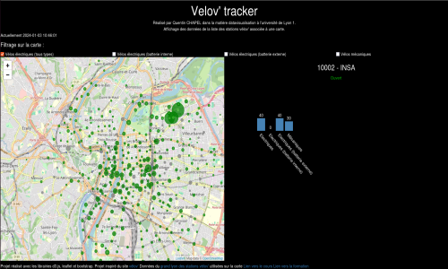

# Velov' Tracker

## Summary

Website done in university through the course [DataVisualisation](https://lyondataviz.github.io/teaching/lyon1-m2/2023/) for the formation [Master 2nd Year speciality DataScience](http://master-info.univ-lyon1.fr/DS/).
This website allows the user to check if a station has the specific bike type for him.
Each station has a its radius based on the numbers of bike spaces in the station.
Through filtering the user can see which corresponding station should be the most adequate for him.

## Suiveur de station vélov'
Site web réalisé dans le cadre universitaire de la matière [DataVisualisation](https://lyondataviz.github.io/teaching/lyon1-m2/2023/) dans la formation universitaire (http://master-info.univ-lyon1.fr/DS/).
Cette application web permet à l'utilisateur de trouver à travers un filtrage des types de vélos la station
la plus adéquate pour lui.

## Inspiration
Ce projet s'inspire du site web [velov](https://velov.grandlyon.com/fr/mapping) qui affiche sur la carte les différentes stations vélov'.

## Choix des données et libraries utilisées
Ce projet a été réalisé avec les langages html et javascript.

Pour traiter les données et les afficher sur la carte, je suis passé par [leaflet](https://leafletjs.com/) et [d3.js](https://github.com/d3/d3).

Pour la page web, [bootstrap](https://getbootstrap.com/) a aussi été utilisé.

Enfin, les données proviennent du site web data grand lyon postées [ici](https://data.grandlyon.com/portail/fr/jeux-de-donnees/stations-velo-v-metropole-lyon-disponibilites-temps-reel/info) mises à jour le le 21/03/2022.
